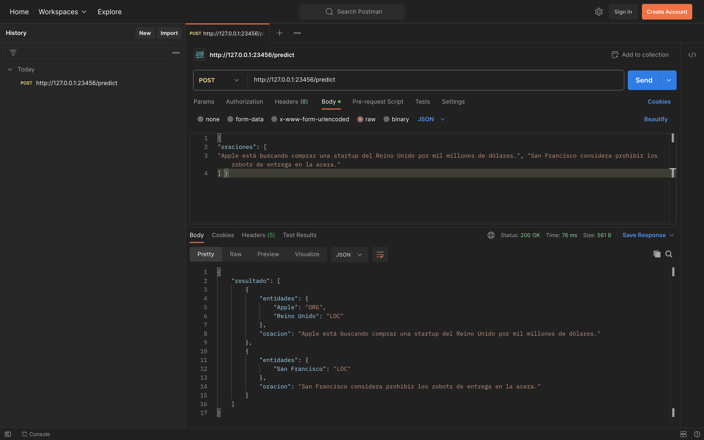

# API para reconocimiento de entidades nombradas en español.

## Dependencias
* Python 3.9.12
* Flask 2.3.2
* SpaCy 3.6.0

## Instrucciones de uso
* Descargar la plataforma [Postman API](https://www.postman.com/downloads/).

* Abrir una terminal y ejecutar el comando `python3 api.py`.

* Abrir la plataforma Postamn API y crear un nuevo _Request_ HTTP, seleccionar el método _POST_ e introducir la url `http://127.0.0.1:23456/predict`.

* Seleccionar la opción _Body_, marcar la casilla _raw_ y elegir el formato _JSON_ en el menú desplegable.

* Introducir el JSON de entrada que contenga las oraciones que se desean analizar separadas por coma y dar click en el botón _Send_. El formato del archivo JSON de entrada es el siguiente:

```json
{
"oraciones": [
"Apple está buscando comprar una startup del Reino Unido por mil millones de dólares.", "San Francisco considera prohibir los robots de entrega en la acera."
] }
```

* La salida es un es un archivo JSON que contiene la oraciones analizadas, así como una lista de las entidades de cada oración y sus etiquetas. El formato del archivo JSON de salida es el siguiente:
```json
{
    "resultado": [
        {
            "entidades": {
                "Apple": "ORG",
                "Reino Unido": "LOC"
            },
            "oracion": "Apple está buscando comprar una startup del Reino Unido por mil millones de dólares."
        },
        {
            "entidades": {
                "San Francisco": "LOC"
            },
            "oracion": "San Francisco considera prohibir los robots de entrega en la acera."
        }
    ]
}
```

* La imagen siguiente muestra la interfaz de la plataforma Postman API con la selección de las opciones descritas anteriormente.



